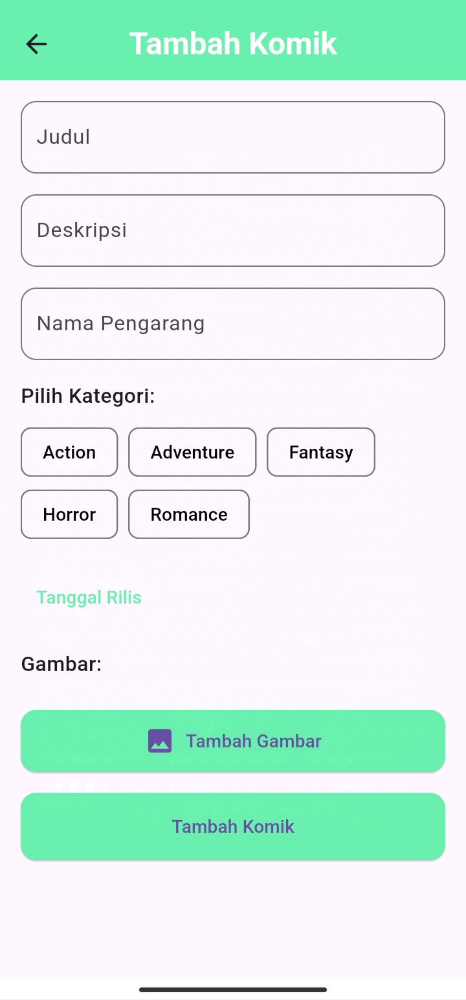
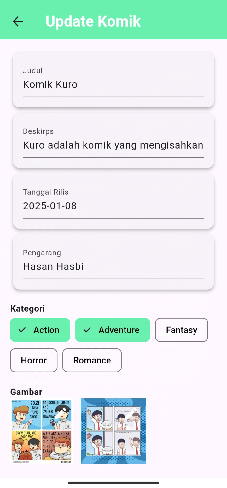

# 📖 KOMIKU – Aplikasi Baca Komik Offline

**KOMIKU** adalah aplikasi mobile berbasis **Flutter** yang digunakan untuk membaca dan mengelola data komik secara **offline** menggunakan database **SQLite**.  
Aplikasi ini menyediakan fitur manajemen komik dengan tampilan sederhana, ringan, dan mudah digunakan.

---

## 🚀 Teknologi yang Digunakan

- **Flutter** – Framework utama
- **Dart** – Bahasa pemrograman
- **SQLite** – Database lokal (offline)
- **Android Studio / VS Code**

---

## ✨ Fitur Aplikasi

- Halaman Login
- Menu
- Kategori
- Cari Komik
- List Komik
- Detail Komik
- Tambah Data Komik
- Edit Data Komik
- Penyimpanan data komik secara **offline**
- Logout

---

## 🖼️ Tampilan Aplikasi

### Halaman Login
<p align="center">
  
</p>

---

### Menu & List Komik
<table align="center">
  <tr>
    <td align="center">
      <br/>
      <b>Menu</b>
    </td>
    <td align="center">
      <br/>
      <b>List Komik</b>
    </td>
  </tr>
</table>

---

### Detail Komik
<table align="center">
  <tr>
    <td align="center">
      <br/>
      <b>Detail Komik</b>
    </td>
    <td align="center">
      <br/>
      <b>Informasi Tambahan</b>
    </td>
  </tr>
</table>

---

### Kategori & Pencarian
<table align="center">
  <tr>
    <td align="center">
      <br/>
      <b>Kategori Komik</b>
    </td>
    <td align="center">
      <br/>
      <b>Cari Komik</b>
    </td>
  </tr>
</table>

---

### Tambah & Edit Komik
<table align="center">
  <tr>
    <td align="center">
      <br/>
      <b>Tambah Komik</b>
    </td>
    <td align="center">
      <br/>
      <b>Edit Komik</b>
    </td>
  </tr>
</table>


---

## 📦 Download APK

 **Download APK di sini:**  
🔗 [Download APK](https://drive.google.com/file/d/16ZfaBJKSyk-MERRo8nK7CPDQWV31qN8O/view?usp=sharing)

> Aktifkan **Install from Unknown Sources** sebelum instalasi APK.

---

## Database

Aplikasi ini menggunakan **SQLite** sebagai database lokal untuk:
- Menyimpan data user
- Menyimpan data komik (judul, genre, deskripsi, dll)
- Digunakan secara **offline** tanpa koneksi internet

---

## Cara Menjalankan Project

```bash
git clone https://github.com/username/nama-repository.git
cd nama-repository
flutter pub get
flutter run
